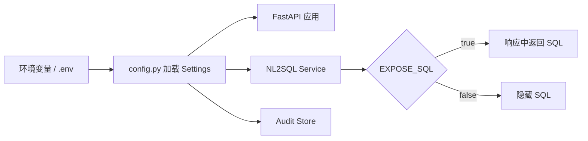

# Day 39 - 配置管理：环境隔离与密钥管理

## 今日目标

今天学习配置管理，把服务里的可变参数从代码里拆出来。

今天要掌握：

- 配置和代码为什么要分离；
- `.env.example` 应该写什么、不应该写什么；
- 开发、测试、生产环境配置有什么差异；
- 密钥为什么不能提交到仓库；
- 配置错误会导致哪些生产问题；
- NL2SQL 服务里哪些开关需要被配置化。

今天产出：

- `projects/day36_42_nl2sql_service/.env.example`；
- `projects/day36_42_nl2sql_service/app/config.py`；
- 配置项说明；
- Day 39 面试沉淀、术语更新和核心问题自测。

---

## 大白话解释

配置就是服务运行时的开关和参数。

例如：

- 当前环境是 `dev`、`test` 还是 `prod`；
- 审计库写到哪里；
- 是否返回 SQL；
- 最大问题长度是多少；
- 外部模型、数据库或配置中心地址是什么；
- 日志级别和监控开关是什么。

这些不应该散落在业务代码里。
否则换环境时就要改代码，很容易把测试配置带到生产，或者把密钥提交到 Git。

---

## 生产实际

金融信贷系统对配置管理很敏感。
例如生产环境不能把 SQL 全量返回给普通用户，审计库路径不能写到临时目录，
模型 API key、数据库密码和内部服务 token 不能出现在代码仓库。

更稳的做法是：

- `.env.example` 只写变量名和示例值；
- 真实密钥放环境变量、密钥系统或配置中心；
- 开发、测试、生产使用不同配置；
- 服务启动时做配置检查；
- 关键配置变更要有审计；
- 敏感开关默认保守，例如生产默认不暴露 SQL。

---

## 配置链路图



配置管理的重点不是多写几个变量，而是让同一份代码在不同环境下用不同运行参数。

---

## 当前配置项拆解

当前 `.env.example` 包含：

```text
APP_NAME=Week 6 NL2SQL Service
APP_ENV=dev
APP_VERSION=0.1.0
NL2SQL_DEMO_RESULT_PATH=projects/day35_nl2sql_assistant/output/nl2sql_assistant_demo_results.json
NL2SQL_AUDIT_DB_PATH=projects/day36_42_nl2sql_service/output/audit.sqlite
MAX_QUESTION_LENGTH=300
EXPOSE_SQL=true
```

这些配置分别解决：

- `APP_NAME`：服务名称，方便健康检查和日志识别；
- `APP_ENV`：运行环境，用来区分开发、测试、生产；
- `APP_VERSION`：服务版本，方便排查发布差异；
- `NL2SQL_DEMO_RESULT_PATH`：Day 35 演示结果路径；
- `NL2SQL_AUDIT_DB_PATH`：审计库路径；
- `MAX_QUESTION_LENGTH`：用户问题长度限制；
- `EXPOSE_SQL`：是否在响应中暴露 SQL。

---

## 常见坑

| 类型 | 可能的问题 | 生产处理方式 |
|------|------------|--------------|
| 密钥 | API key、数据库密码提交到 Git | 使用环境变量、密钥系统或配置中心 |
| 环境 | 测试配置误用于生产 | 显式区分 `dev/test/prod`，启动时打印非敏感配置 |
| 开关 | 生产误开启 `EXPOSE_SQL` | 敏感开关默认关闭，变更走审批 |
| 路径 | 容器内路径和本地路径不一致 | 使用环境变量配置路径，并在启动时检查 |
| 文档 | 新增配置但 `.env.example` 没更新 | 配置变更必须同步示例文件和 README |
| 排查 | 配置错误只表现为 500 | 启动时做配置校验，错误信息明确指向缺失项 |

---

## 工程取舍

### 取舍一：为什么用 `.env.example`，而不是提交 `.env`？

`.env.example` 是配置说明书，告诉别人需要哪些变量。
真实 `.env` 可能包含密钥、生产地址和内部服务 token，不能提交。
仓库里保留示例值就够了，真实值由本地环境、部署平台或密钥系统提供。

### 取舍二：为什么配置要集中到 `config.py`？

集中加载配置可以让业务代码不用到处读环境变量。
API、service、storage 都依赖同一个 Settings 对象，字段含义清晰，也方便测试替换。
如果到处散落 `os.getenv`，后续排查配置来源会很困难。

### 取舍三：`EXPOSE_SQL` 为什么要做成开关？

SQL 对研发排查有价值，但对普通业务用户可能是敏感信息。
开发环境可以打开，方便调试；生产环境通常应该关闭，或者只对管理员开放。
这就是配置管理的意义：同一套代码，不同环境用不同安全策略。

---

## 本地练习

查看配置文件：

```text
projects/day36_42_nl2sql_service/.env.example
projects/day36_42_nl2sql_service/app/config.py
```

示例配置：

```bash
APP_ENV=dev
EXPOSE_SQL=true
NL2SQL_AUDIT_DB_PATH=projects/day36_42_nl2sql_service/output/audit.sqlite
```

验证服务配置是否生效：

```bash
cd /Users/lxy/Documents/ai_transition
PYTHONPATH=projects/day36_42_nl2sql_service \
uvicorn app.main:app --host 127.0.0.1 --port 8000
```

访问健康检查：

```bash
curl http://127.0.0.1:8000/health
```

---

## 面试沉淀

Q089：为什么配置和密钥不能写死在代码里？

### 回答

配置和密钥不能写死在代码里，因为不同环境的数据库地址、开关、路径、日志级别和权限策略都可能不同。
如果写死在代码里，切换开发、测试、生产环境就必须改代码，容易引入误配置。

密钥更不能提交到 Git，因为一旦泄露，可能导致模型账户、数据库或内部服务被滥用。
生产里应该用环境变量、配置中心或密钥系统管理真实配置，
仓库里只保留 `.env.example` 说明需要哪些变量和示例值。

对 NL2SQL 服务来说，配置管理还关系到安全边界。
例如生产环境是否允许返回 SQL、审计库写到哪里、最大问题长度是多少、模型服务地址是什么，
这些都应该由配置控制，而不是写死在业务代码里。

完整题目已同步到：

```text
docs/interview_core_questions.md
```

---

## 术语更新

今天新增或强化这些术语：

- 配置管理：把环境、路径、开关和外部依赖地址从代码中拆出来统一管理。
- `.env.example`：配置样例文件，只放变量名和示例值，不放真实密钥。
- 环境变量：由运行环境注入的配置值。
- 密钥管理：用专门机制保存 API key、数据库密码和 token。
- 配置中心：集中管理多环境配置的系统。

这些术语已补充到：

```text
notes/terminology_glossary.md
```

---

## 每日核心问题自测

### A. 今日核心问题

### 1. 为什么配置不能全部写死在代码里？
  我的回答：
数据库地址、开关、路径、日志级别和权限策略都可能不同，更换环境导致这些配置还需重新编辑

回答评价：
通过。回答抓住了核心：不同环境的地址、开关、路径、日志级别和权限策略不同，写死配置会导致切换环境必须改代码。
可以再补充：配置写死还会增加误发布、误连生产库和安全泄露风险。

参考答案：
配置不能全部写死在代码里，因为开发、测试和生产环境通常使用不同的数据库地址、文件路径、日志级别、权限策略和功能开关。
如果配置写死，切换环境就必须改代码，容易把测试配置带到生产，或者让生产服务连错数据库。
更好的方式是把配置集中到 `config.py`，通过环境变量、`.env`、配置中心或密钥系统注入。
这样同一份代码可以在不同环境使用不同运行参数。

### 2. `.env.example` 应该包含什么，不应该包含什么？
  我的回答：
变量名和示例值

回答评价：
通过。回答正确：`.env.example` 应该包含变量名和示例值。
可以再补充：它不应该包含真实密钥、真实生产数据库地址或内部 token。

参考答案：
`.env.example` 应该包含服务需要的环境变量名、示例值、默认值和简单说明，帮助别人知道本地启动需要配置什么。
它不应该包含真实 API key、数据库密码、生产地址、内部服务 token 或任何敏感信息。
真实配置应该由本地 `.env`、环境变量、配置中心或密钥系统提供，并且真实 `.env` 通常不提交到 Git。

### 3. 开发、测试、生产配置通常有哪些差异？
  我的回答：
数据库地址、开关、路径、日志级别和权限策略都可能不同

回答评价：
通过。回答覆盖了主要差异。
可以再补充：生产环境通常更保守，例如关闭 SQL 暴露、启用更严格权限、接正式审计库和监控。

参考答案：
开发、测试、生产配置通常在数据库地址、审计库路径、日志级别、功能开关、权限策略、密钥、模型服务地址和监控告警上不同。
开发环境偏调试，可以暴露更多中间信息；测试环境偏验证，使用测试数据和固定回归集；
生产环境偏安全稳定，通常关闭敏感信息暴露，使用正式数据库、正式密钥、正式审计和监控告警。

### 4. 密钥提交到 Git 会造成什么风险？
  我的回答：
暴露数据库，内部核心业务数据

回答评价：
通过。回答指出了数据库和内部业务数据泄露风险。
可以再补充：密钥泄露还可能导致模型账户被盗用、内部服务被调用、产生费用损失和合规风险。

参考答案：
密钥提交到 Git 会造成严重泄露风险。
数据库密码泄露可能导致内部业务数据被读取或篡改；
模型 API key 泄露可能导致账户被滥用并产生费用；
内部服务 token 泄露可能让攻击者绕过正常访问入口。
即使仓库是私有的，也不能把真实密钥提交进去。
生产里应该用环境变量、密钥系统或配置中心管理密钥，并对泄露密钥及时轮换。

### 5. `EXPOSE_SQL` 这类开关在 NL2SQL 服务里有什么意义？
  我的回答：
控制接口响应里是否暴露生成的 SQL，避免敏感信息暴露给普通用户

回答评价：
通过。修正后的回答准确说明了 `EXPOSE_SQL` 的作用：控制响应里是否暴露生成 SQL，并避免敏感信息暴露给普通用户。
可以再补充：开发环境可以打开用于调试，生产环境通常关闭或只对管理员开放。

参考答案：
`EXPOSE_SQL` 这类开关用于控制 NL2SQL 接口响应里是否返回生成的 SQL。
SQL 对研发排查很有价值，但也可能暴露表名、字段名、业务口径、过滤条件和敏感查询逻辑。
开发环境可以打开，方便调试 SQL 生成和校验链路；
生产环境通常应该关闭，或者只允许管理员和研发通过 trace 接口查看。
这类开关体现了配置管理和安全边界的结合。

### B. 前两天核心回顾

### 6. [Day 37] 接口规范为什么要区分业务阻断和系统错误？
  我的回答：
业务阻断是系统本身策略，系统错误是遭遇了 bug 等错误，需要排查

回答评价：
通过。回答正确区分了业务阻断和系统错误。
可以再补充：业务阻断应该返回业务状态，系统错误才进入 500 和日志排查。

参考答案：
接口规范要区分业务阻断和系统错误，因为它们代表完全不同的含义。
业务阻断是权限、安全、成本或合规策略按预期生效，例如敏感字段查询被拒绝；
系统错误是代码 bug、依赖故障、配置错误或数据库连接失败。
如果都返回 500，调用方无法判断是系统坏了，还是安全策略拦住了请求。
NL2SQL API 通常用 `final_status=safely_blocked` 表达业务阻断，用统一错误响应表达系统异常。

### 7. [Day 38] Dockerfile 解决什么部署问题？
  我的回答：
环境要求写成可重复执行的步骤，让别人能按同样方式构建和启动服务。

回答评价：
通过。回答准确说明 Dockerfile 把环境要求和启动方式变成可重复步骤。
可以再补充：它解决的是环境一致性、依赖可复现和标准化启动入口。

参考答案：
Dockerfile 解决的是部署时运行环境不一致的问题。
它把基础镜像、依赖安装、代码复制、环境变量、端口和启动命令写成固定步骤，
让开发、测试和部署可以按同样方式构建镜像并启动服务。
这样就减少了“本地能跑，换服务器就坏”的问题。
但 Dockerfile 只是交付基础，生产还需要配置、密钥、日志、监控和发布流程。

### 8. [Day 38] Docker 化后为什么仍然需要配置管理？
  我的回答：
是生产中必要的步骤，要做到环境和密钥的配置

回答评价：
通过。回答指出 Docker 化后仍然需要环境和密钥配置。
可以再补充：镜像应该尽量通用，环境差异应在运行时注入，而不是打进镜像。

参考答案：
Docker 化后仍然需要配置管理，因为镜像只解决运行环境一致性，不解决不同环境参数差异。
同一个镜像可能要运行在开发、测试和生产环境，但这些环境的数据库地址、审计路径、密钥、日志级别和安全开关都不同。
如果把这些配置写死进镜像，就无法安全复用，也容易泄露密钥。
正确做法是镜像保持通用，运行时通过环境变量、配置中心或密钥系统注入不同环境配置。
