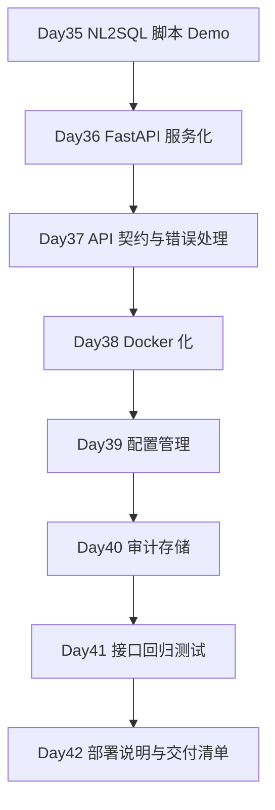

# Day 42 - 周复盘与部署说明：像产品一样交付

## 今日目标

今天是第 6 周收口日，把 Week 6 的服务化项目整理成可交付版本。

今天要掌握：

- 什么叫“像产品一样交付”；
- 部署说明应该包含哪些内容；
- 演示前要做哪些冒烟检查；
- 如何讲清 Week 6 的工程化价值；
- 第 7 周 Agent 工作流之前还缺什么；
- 如何把脚本 Demo 包装成可启动、可测试、可排查的服务项目。

今天产出：

- `projects/day36_42_nl2sql_service/docs/deployment.md`；
- Week 6 服务化项目 README；
- Week 6 交付清单；
- Day 42 面试沉淀、术语更新和核心问题自测。

---

## 大白话解释

一个项目能跑，不等于能交付。

能交付至少要让别人知道：

- 怎么启动；
- 怎么配置；
- 怎么测试；
- 怎么用接口；
- 出错怎么排查；
- Docker 怎么构建；
- 哪些能力已经完成；
- 哪些还只是演示版；
- 安全边界在哪里。

Day 42 的重点是把第 6 周的工程化成果讲清楚。
这比单纯写更多代码更重要，因为面试和真实协作都需要别人能理解、能启动、能验证你的项目。

---

## 生产实际

面试或内部评审时，工程化能力往往体现在这些细节：

- README 是否能让别人启动；
- API 是否有规范；
- 错误是否可控；
- 配置是否可替换；
- 审计是否可追踪；
- 测试是否能跑；
- 部署说明是否完整；
- 安全边界是否讲得清楚；
- 演示路径是否稳定；
- 限制和下一步是否诚实说明。

这些能力能证明你不是只会写 Demo，而是在按生产服务思路做 AI 应用。

---

## Week 6 交付链路图



这条线说明：Week 6 不是在学零散工具，而是在把 NL2SQL 项目从脚本推进到服务化交付形态。

---

## Week 6 交付清单

| 能力 | 对应产物 | 价值 |
|------|----------|------|
| 服务入口 | `app/main.py` | 把 NL2SQL 能力变成 HTTP API |
| 请求响应模型 | `app/schemas.py` | 固定接口契约，减少前后端猜字段 |
| 业务编排 | `app/services.py` | 组织问答、状态、trace 和安全阻断 |
| 统一错误 | `app/errors.py` | 避免底层异常直接暴露 |
| 配置管理 | `app/config.py`、`.env.example` | 支持多环境和敏感开关 |
| 审计存储 | `app/storage.py`、`audit.sqlite` | 支持 request_id 回放 |
| Docker 化 | `Dockerfile` | 提供标准化运行环境 |
| 回归测试 | `tests/test_api.py` | 每次改动后验证主链路 |
| 部署说明 | `docs/deployment.md` | 让别人能启动、测试、排查 |

---

## 常见坑

| 类型 | 可能的问题 | 生产处理方式 |
|------|------------|--------------|
| 交付 | README 只有启动命令，没有项目说明 | 写清用途、接口、配置、测试、限制和生产映射 |
| 演示 | 只准备成功样例 | 同时准备成功、安全阻断、不支持和 trace 样例 |
| 部署 | 只说 Docker build，不说健康检查 | 部署说明包含启动、检查、测试和排查 |
| 安全 | 没讲 SQL 暴露、trace 权限和审计边界 | 明确哪些能力仅限研发或管理员 |
| 质量 | 没有回归测试 | 演示前固定跑 API 测试和关键接口 |
| 真实度 | 把本地 Demo 说成生产系统 | 诚实说明演示版与生产版差距 |

---

## 工程取舍

### 取舍一：为什么 Day42 不继续堆功能，而是做交付说明？

因为项目价值不只在功能数量，还在别人能不能理解和运行。
如果没有启动、配置、测试、接口和排查说明，项目就只能停留在作者本地。
交付说明把项目从“能跑”推进到“可协作、可评审、可演示”。

### 取舍二：Week 6 项目哪些地方仍然是演示版？

当前项目仍然使用 Day35 静态演示结果，没有接真实在线模型、真实数据库、真实权限系统和生产监控。
SQLite 审计也只适合本地演示。
这些限制应该在 README 和面试表达里讲清楚，避免把学习版夸成生产完备系统。

### 取舍三：如何表达 Week 6 的生产化价值？

重点不要说“我写了 FastAPI”，而要说：
我把 NL2SQL 脚本拆成服务入口、接口契约、业务编排、配置、审计、错误处理、Docker 和测试。
这说明你理解 AI 应用上线不只是模型效果，还包括调用边界、可观测、可审计、可部署和可回归。

---

## 本地练习

部署说明：

```text
projects/day36_42_nl2sql_service/docs/deployment.md
```

完整交付检查：

```bash
cd /Users/lxy/Documents/ai_transition
python3 projects/day35_nl2sql_assistant/main.py
PYTHONPATH=projects/day36_42_nl2sql_service python3 -m unittest discover \
  -s projects/day36_42_nl2sql_service/tests
```

启动服务：

```bash
PYTHONPATH=projects/day36_42_nl2sql_service \
uvicorn app.main:app --host 127.0.0.1 --port 8000
```

冒烟检查：

```bash
curl http://127.0.0.1:8000/health
curl http://127.0.0.1:8000/nl2sql/questions
curl -X POST http://127.0.0.1:8000/nl2sql/ask \
  -H "Content-Type: application/json" \
  -d '{"question":"导出客户手机号列表","user_id":"demo_user"}'
```

---

## 面试沉淀

Q092：什么叫把 AI 应用像产品一样交付？

### 回答

把 AI 应用像产品一样交付，意思是它不只是一个能跑的 Demo，
还要有清晰启动方式、接口规范、配置说明、测试方法、部署说明、错误排查和安全边界。
别人拿到项目后，应该能按 README 启动服务，调用接口，理解返回字段，
运行测试，并知道常见问题怎么排查。

对 NL2SQL 项目来说，还要能展示成功查询、安全阻断、审计记录和结果解释。
更进一步，还要说明哪些能力是演示版，哪些能力在生产里需要替换成真实数据库、权限系统、监控和模型服务。
这类交付方式能证明项目具备工程化能力，而不是只在本地临时跑通。

完整题目已同步到：

```text
docs/interview_core_questions.md
```

---

## 术语更新

今天新增或强化这些术语：

- 部署说明：说明服务如何启动、配置、测试、部署和排查问题的文档。
- 交付清单：列出项目交付前必须具备的代码、文档、测试和配置项。
- 冒烟检查：演示或发布前快速确认关键链路可用。
- 产品化交付：把 Demo 整理成别人能理解、能运行、能验证的项目形态。
- 生产化缺口：学习版距离真实生产系统还缺的能力。

这些术语已补充到：

```text
notes/terminology_glossary.md
```

---

## 每日核心问题自测

### A. 今日核心问题

### 1. 什么叫把 AI 应用“像产品一样交付”？
  我的回答：
不像是一个 demo，要有完整的链路，方便工程化，要有接口管理，配置管理，业务编排，错误管理，审计存储，回归测试等

回答评价：
方向正确。你抓住了“不是 demo”和“完整工程链路”两个重点。
还可以再补充启动说明、配置说明、部署说明、错误排查和安全边界，这样更像面试里的完整回答。

参考答案：
把 AI 应用像产品一样交付，是指项目不只在本机能跑，还要让别人能理解、启动、调用、测试、部署和排查。
它通常包括 README、API 契约、配置说明、Docker 或部署方式、回归测试、错误处理、审计记录和安全边界说明。
在 NL2SQL 场景里，还要能展示正常查询、安全阻断、trace 回放和生产化缺口。

### 2. 部署说明至少应该包含哪些内容？
  我的回答：
接口管理，配置管理，业务编排，错误管理，审计存储，回归测试等

回答评价：
回答覆盖了服务能力，但“部署说明”本身还要更偏操作手册。
需要明确怎么安装依赖、怎么配置环境变量、怎么启动、怎么健康检查、怎么跑测试、怎么排查常见问题。

参考答案：
部署说明至少应包含项目用途、依赖安装、环境变量、启动命令、Docker 构建和运行方式、健康检查、关键接口冒烟命令、测试命令、日志和常见问题排查。
如果是 AI 应用，还要说明模型、数据库、权限、审计和敏感配置的边界。

### 3. 演示前为什么要做冒烟检查？
  我的回答：
最小的测试来测试服务是否可以跑通，可以正常运行

回答评价：
正确。冒烟检查就是用最小成本确认主链路没坏。
可以再补充：它不是完整测试，而是演示或发布前确认关键接口、配置、依赖和样例数据可用。

参考答案：
演示前做冒烟检查，是为了快速确认服务启动、健康检查、关键接口、样例数据、安全阻断和审计链路都可用。
它不能替代完整回归测试，但能提前发现端口、配置、依赖、文件路径和接口返回异常，避免演示时主链路直接失败。

### 4. 第 6 周服务化项目相比脚本 Demo 提升在哪里？
  我的回答：
要有完整的链路，方便工程化，要有接口管理，配置管理，业务编排，错误管理，审计存储，回归测试等

回答评价：
回答准确，已经说到服务化的关键模块。
更完整的表达可以强调：脚本是单机验证，服务化后能被外部系统稳定调用，并具备可配置、可审计、可测试和可部署能力。

参考答案：
第 6 周服务化项目相比脚本 Demo 的提升在于，它把 NL2SQL 能力拆成 API 入口、请求响应模型、业务编排、统一错误、配置管理、审计存储、Docker 和回归测试。
这让项目从“本地跑脚本”变成“别人可以通过 HTTP 调用、按文档启动、按测试验证、按 request_id 排查”的服务形态。

### 5. Week 6 项目还有哪些生产化缺口？
  我的回答：
没有实际的大规模数据的使用，大量交互的能力未知

回答评价：
回答抓住了数据规模和并发交互这两个真实缺口。
还可以补充真实模型、真实数据库、权限系统、监控告警、SQL 执行网关、灰度发布和成本控制。

参考答案：
Week 6 项目仍然是学习版，主要缺口包括：没有接真实 LLM、没有接真实数仓、没有生产级权限系统、没有 SQL 执行网关、没有监控告警、没有并发压测、没有灰度发布和真实用户反馈闭环。
SQLite 审计和静态样例适合本地演示，但生产需要更强的数据库、权限、日志、监控和运维体系。

### B. 本周核心回顾

### 6. [Day 36] 后端服务为什么要分层？
  我的回答：
每个层级负责不同的功能，解耦，也方便开发

回答评价：
正确。分层的核心就是职责清楚、降低耦合、方便替换和测试。

参考答案：
后端服务分层是为了把 API 接入、业务编排、配置、存储、错误处理拆开。
这样接口契约变化、业务规则变化、存储替换或模型替换时，不会牵连所有代码。
在 NL2SQL 服务里，分层还能让 request_id、审计、安全阻断和结果解释更容易维护。

### 7. [Day 37] 接口错误为什么要统一格式？
  我的回答：
统一口径方便各个层级交互，也方便测试找错

回答评价：
正确。统一错误格式能让调用方、测试和排查都更稳定。

参考答案：
接口错误统一格式，是为了让前端、调用方和测试脚本稳定识别错误类型、错误码、提示信息和 request_id。
安全阻断、参数错误、系统异常不能混成一类，否则业务用户和研发都不知道该修改输入、补权限还是排查服务故障。

### 8. [Day 40] 为什么审计记录对金融信贷 NL2SQL 很重要？
  我的回答：
是比日志记录更有可信度，方便追溯整个链路，是否合法合规，方便追责

回答评价：
回答很好，已经覆盖追溯、合规和追责。
可以再补一句：审计要记录用户问题、解析结果、SQL、校验、执行和最终解释，而不是只记一行日志。

参考答案：
金融信贷 NL2SQL 涉及授信、放款、还款、逾期和客户信息，必须能追溯用户问了什么、系统生成了什么 SQL、是否通过安全校验、执行结果是什么、最后如何解释。
审计记录能支持 bad case 排查、权限合规、责任追踪和模型效果优化。

### 9. [Day 41] 为什么安全阻断样例要进入测试集？
  我的回答：
测试安全阻断是否可用，该拒绝回答适合拒绝，是否正常阻断

回答评价：
正确。生产系统不能只测试成功样例，必须证明危险问题会被稳定拦住。

参考答案：
安全阻断样例必须进入测试集，因为敏感字段、危险 SQL、缺少时间范围和高成本查询是生产里的核心风险。
每次修改 Prompt、校验规则或服务代码后，都要确认这些风险不会被绕过。
如果只测成功查询，无法证明系统具备金融信贷场景需要的权限、安全和合规能力。
