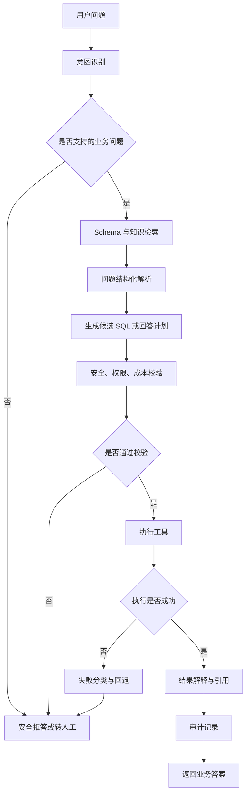

# Day 43 - Agent 思路：流程编排

## 今日目标

今天进入第 7 周，主题从“一个服务能不能交付”升级到“多个能力怎么协同完成业务任务”。

今天要掌握：

- 什么是 Agent 工作流；
- Agent 和普通接口调用有什么区别；
- 如何把 RAG、NL2SQL、SQL 校验、执行、解释串成一条链路；
- 为什么每一步都要有输入、输出、失败条件和回退策略；
- 金融信贷场景里，Agent 不能只追求自动化，还要优先保证权限、安全、审计和可解释。

今天产出：

- `projects/day43_agent_workflow/`；
- Agent 工作流结构化定义；
- Agent Mermaid 流程图；
- Day 43 面试沉淀、术语更新和核心问题自测。

---

## 大白话解释

Agent 可以先理解成“会按步骤调工具的业务助理”。

普通接口调用通常是：

```text
用户问题 -> 一个接口 -> 一个结果
```

Agent 工作流更像：

```text
用户问题
-> 判断意图
-> 查资料或查 schema
-> 生成候选 SQL
-> 校验安全和成本
-> 执行查询
-> 解释结果
-> 留下审计记录
```

它不是让大模型随便自由发挥，而是给它一个受控流程：

- 哪一步能调用什么工具；
- 每一步需要什么输入；
- 每一步必须产出什么结构化结果；
- 出错时是重试、降级、拒答还是转人工；
- 哪些场景必须被权限和安全规则拦住。

所以 Day 43 的重点不是“让 Agent 看起来很智能”，而是把流程边界画清楚。
只有流程清楚，后面 Day 44 的多工具协同、Day 45 的端到端评测、Day 46 的错误治理才有落点。

---

## 生产实际

在金融信贷业务里，Agent 可以用在这些场景：

| 场景 | Agent 要做什么 | 风险控制 |
|------|----------------|----------|
| 经营数据问答 | 回答授信申请量、通过率、放款金额、逾期率等指标问题 | 限制只读 SQL、强制时间范围、记录审计 |
| 风控策略解释 | 根据规则文档解释某个拒绝原因或规则口径 | 引用知识库来源，不能编造政策 |
| 贷后运营分析 | 查询逾期账龄、催收效果、还款趋势 | 控制明细导出和客户敏感字段 |
| 合规审计辅助 | 回放用户问了什么、系统查了什么、为什么拒答 | request_id 串联完整链路 |
| 业务日报生成 | 汇总当天核心指标并生成文字解读 | 指标口径固定，异常数据要提示 |

真实公司不会直接把“用户问题”扔给模型让它自由决定所有事。
生产里的 Agent 更像一个受控编排层：模型负责理解和生成候选方案，规则、工具、权限和审计负责兜住风险。

---

## Day 43 Agent 工作流



这张图把 Agent 拆成 10 个可解释步骤。
后续每一步都可以单独做测试：意图识别是否稳定、Schema 是否选对、SQL 是否被校验、执行失败是否有回退、解释是否过度。

---

## 常见坑

| 类型 | 可能的问题 | 生产处理方式 |
|------|------------|--------------|
| 流程 | 让模型自由决定所有工具调用 | 固定工作流状态机，明确每一步输入输出 |
| 安全 | 未校验就执行 SQL 或导出明细 | SQL 校验、字段黑名单、权限检查和只读账号 |
| 质量 | 工具失败后继续编答案 | 失败分类，无法确认时拒答或转人工 |
| 成本 | 多轮工具调用没有上限 | 设置最大步数、超时、缓存和降级策略 |
| 审计 | 只记录最终答案 | 记录 request_id、意图、工具、SQL、校验、执行和解释 |
| 评测 | 只测单个工具，不测端到端链路 | 建立端到端测试集，覆盖成功、拒答、失败和边界样例 |

---

## 工程取舍

### 取舍一：为什么 Day 43 先画流程，而不是直接写复杂 Agent？

因为 Agent 最容易失控的地方不是代码难写，而是边界不清。
如果没有先定义步骤、工具权限、失败回退和审计字段，后面模型一旦选错工具、生成错 SQL 或解释过度，就很难定位是哪一步出问题。

先画流程图和结构化步骤，是为了让系统变成可测试、可排查、可迭代的工程系统。

### 取舍二：为什么不让模型直接生成最终答案？

金融信贷场景里，问题经常涉及指标口径、客户数据、风控规则和合规边界。
模型直接回答容易编造口径、绕过权限或误读数据。

更稳的方式是让模型只负责部分非确定性任务，例如意图识别、问题改写、候选 SQL 生成和结果解释。
真正涉及权限、安全、执行和审计的部分，必须交给确定性代码和规则。

### 取舍三：Agent 和服务化项目是什么关系？

Week 6 的 NL2SQL 服务提供了稳定接口、配置、审计、测试和部署方式。
Week 7 的 Agent 不是推翻它，而是在服务化项目上方增加一个编排层：

```text
Agent 编排层 -> 调用 RAG / NL2SQL / SQL 校验 / 查询执行 / 解释服务
```

这样能复用已经做好的服务能力，而不是重新写一套混乱逻辑。

---

## 本地练习

今天的本地练习是创建一个 Agent 工作流定义项目：

```text
projects/day43_agent_workflow/
```

运行方式：

```bash
python3 projects/day43_agent_workflow/main.py
```

运行后会生成：

```text
projects/day43_agent_workflow/output/agent_workflow.json
projects/day43_agent_workflow/output/agent_workflow.mmd
projects/day43_agent_workflow/output/agent_workflow_report.md
```

这个练习暂时不接真实 LLM。
它先把 Agent 的步骤、工具、失败回退和审计点定义清楚，后续 Day 44 再继续扩展多工具调用策略。

---

## 面试沉淀

Q093：Agent 工作流为什么不能让模型完全自由调用工具？

### 回答

生产环境里的 Agent 不能让模型完全自由调用工具，因为工具通常连接数据库、知识库、业务系统或外部接口。
如果模型没有受控流程，可能会选错工具、重复调用、绕过权限、执行高成本查询，甚至把失败结果编造成确定答案。

更稳的做法是把 Agent 设计成受控工作流：先识别意图，再检索 schema 或知识，生成候选操作，经过权限、安全、成本和格式校验后再执行。
每一步都要有结构化输入输出、最大调用次数、失败回退和审计记录。

在金融信贷 NL2SQL 场景里，Agent 不能直接执行模型生成的 SQL。
必须先检查敏感字段、时间范围、只读限制、表权限和扫描成本。
如果校验失败，就应该拒答或转人工，而不是继续生成看似合理的答案。
这种设计能在智能化和可控性之间取得平衡。

完整题目已同步到：

```text
docs/interview_core_questions.md
```

---

## 术语更新

今天新增或强化这些术语：

- Agent 工作流：把多个模型能力、工具调用和业务规则按固定步骤编排起来的流程。
- 编排层：负责决定先做什么、后做什么、失败怎么处理的控制层。
- 工具调用边界：规定 Agent 在什么条件下能调用哪些工具，避免越权或乱调。
- 失败回退：工具失败、校验失败或信息不足时，系统如何降级、拒答或转人工。
- 最大步数：限制 Agent 最多执行多少步，防止无限循环和成本失控。

这些术语已补充到：

```text
notes/terminology_glossary.md
```

---

## 每日核心问题自测

### A. 今日核心问题

### 1. Agent 工作流和普通接口调用最大的区别是什么？
  我的回答：
接口只是提供一个对外调用的接口， 
  工作流是一套完整的工作链路，包含意图识别，问题改写，其中包含接口调用，安全权限边界审核，审计，完整流程

回答评价：
回答方向正确。你抓住了“接口只是单点调用，工作流是一整条链路”这个核心。
可以再补充一点：Agent 工作流不仅包含多个步骤，还要定义每一步的输入输出、工具边界、失败回退和审计字段。

参考答案：
普通接口调用通常是用户请求进入一个接口，然后返回一个结果。
Agent 工作流是一套受控链路，会按步骤完成意图识别、上下文检索、问题解析、候选 SQL 或回答计划生成、安全校验、工具执行、结果解释和审计记录。
它的重点不是多调用几个接口，而是把每一步的职责、边界、失败处理和可追溯性设计清楚。

### 2. 为什么金融信贷 NL2SQL Agent 不能直接执行模型生成的 SQL？
  我的回答：
模型生成的 sql 要经过安全权限边界审核，性能成本测试

回答评价：
正确。你已经说到安全、权限、性能和成本。
更完整的表达可以把风险说清楚：模型生成的 SQL 可能字段越权、缺少时间范围、扫描大表、查询敏感字段，甚至不符合业务口径。

参考答案：
金融信贷 NL2SQL Agent 不能直接执行模型生成的 SQL，因为 SQL 一旦执行就会真实访问数据。
模型生成结果可能包含敏感字段、越权表、错误指标口径、缺少时间范围、高成本扫描或危险操作。
生产里必须先经过 Schema 约束、只读校验、权限检查、敏感字段拦截、时间范围和成本控制，只有校验通过后才能进入执行层。

### 3. Day 43 的 Agent 工作流里，哪些步骤必须做安全或权限控制？
  我的回答：
确定的业务核心操作，schema 校验，涉及到安全边界和权限的内容

回答评价：
方向对，但还可以更具体。
安全和权限控制不只在一个点上做，至少要覆盖意图识别、Schema 与知识检索、SQL 生成、SQL 校验、执行和结果解释。

参考答案：
Day 43 工作流里，意图识别要识别敏感导出和不支持问题；Schema 与知识检索要按用户权限过滤；
问题解析要标记敏感维度和缺失条件；SQL 生成只能基于允许的表字段生成只读 SQL；
SQL 校验要检查敏感字段、权限、时间范围、limit 和成本；执行层必须使用只读账号和超时限制；
结果解释不能泄露越权信息，也不能基于不存在的数据编造原因。

### 4. 工具执行失败后，Agent 为什么不能继续编一个看似合理的答案？
  我的回答：
失败后进行拒答，不可以编造，导致用户信任度下降

回答评价：
正确。你说到了拒答和信任问题。
面试里可以再补一句：工具失败说明系统没有可靠事实依据，继续回答会把系统异常伪装成业务结论。

参考答案：
工具执行失败后，Agent 不能继续编答案，因为这时系统没有可靠的数据、引用或执行结果。
如果继续生成看似合理的结论，可能误导业务判断，掩盖真实故障，也无法审计回放。
正确做法是分类失败原因，例如参数缺失、安全阻断、无引用、执行超时或系统异常，然后拒答、要求补充条件、降级或转人工。

### 5. 为什么 Agent 工作流要记录 request_id 和中间步骤？
  我的回答：
方便审计追踪，追溯流程链路

回答评价：
正确，核心点已经覆盖。
可以再补充：中间步骤记录还能支持 bad case 排查、评测回放、成本分析和责任定位。

参考答案：
Agent 工作流要记录 request_id 和中间步骤，是为了让一次回答可以被完整回放。
当答案错误、被安全阻断、工具失败或用户质疑结果时，研发可以追踪原始问题、意图识别、检索结果、生成 SQL、校验结果、执行状态、返回行数和最终解释。
这对金融信贷场景里的权限合规、审计追责、问题修复和评测优化都很关键。

### B. 前两天核心回顾

### 6. [Day 41] NL2SQL 服务最小回归测试应该覆盖哪些场景？
  我的回答：
普通高频问题，安全边界权限问题，拒绝回答的问题

回答评价：
基本正确。你覆盖了正常问题、安全边界和拒答。
还可以补充健康检查、审计追踪和接口错误处理，这样更接近“最小回归测试”的完整范围。

参考答案：
NL2SQL 服务最小回归测试至少要覆盖健康检查、正常查询、安全阻断和审计追踪。
健康检查确认服务可用，正常查询确认主链路能回答，安全阻断确认敏感字段或危险 SQL 不会被执行，审计追踪确认 request_id 能回查完整记录。
如果只测成功样例，就不能证明服务具备生产需要的安全和可追溯能力。

### 7. [Day 42] 什么叫把 AI 应用“像产品一样交付”？
  我的回答：
他是一个拥有完整链路，
可信赖，可追溯，可协同完成业务任务，
意图识别是否稳定、Schema 是否选对、SQL 是否被校验、执行失败是否有回退、解释是否过度。

回答评价：
回答有生产化意识，提到了完整链路、可信赖、可追溯和可协同。
这题还可以更贴近 Day 42 的主题：产品化交付要让别人能启动、调用、测试、部署和排查。

参考答案：
把 AI 应用像产品一样交付，是指它不只是一个本地 Demo，还要有清晰的 README、接口契约、配置说明、启动命令、测试方法、部署说明、错误排查和安全边界。
别人拿到项目后，应该能按文档启动服务、调用接口、理解返回字段、运行回归测试，并知道常见问题怎么排查。
对 NL2SQL 项目来说，还要能展示正常查询、安全阻断、审计记录和结果解释。
