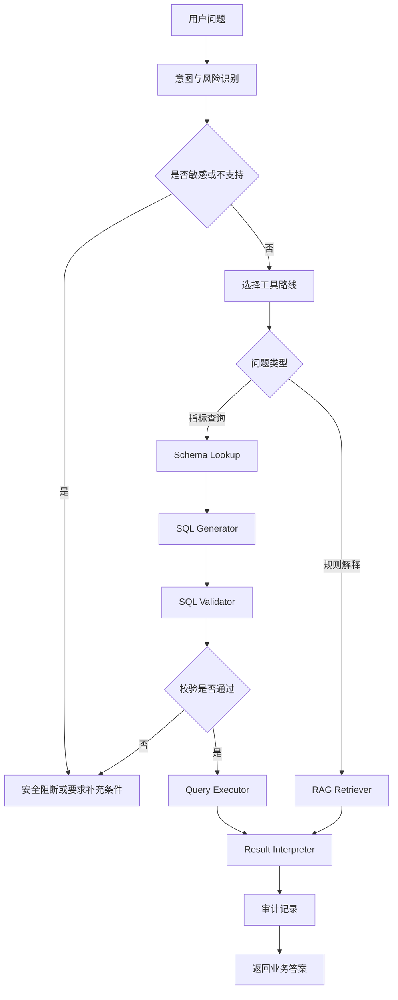

# Day 44 - 工具协同：多工具调用策略

## 今日目标

Day 43 先把 Agent 工作流画清楚，Day 44 继续往下拆：当 Agent 手里有多个工具时，应该怎么选择、怎么串联、怎么失败回退。

今天要掌握：

- 多工具调用不是“模型想调哪个就调哪个”；
- 工具必须有适用条件、输入输出、权限边界和失败处理；
- Agent 要有最大步数、禁止重复无意义调用、失败分类和终止条件；
- 金融信贷场景里，SQL 执行、RAG 检索、权限校验和结果解释不能混在一起随便调用；
- 工具编排策略要能被测试和审计。

今天产出：

- `projects/day44_tool_orchestration/`；
- 工具注册表；
- 多工具调用策略；
- 失败回退和循环保护示例；
- Day 44 面试沉淀、术语更新和核心问题自测。

---

## 大白话解释

多工具 Agent 可以理解成一个“有工具箱的业务助理”。

工具箱里可能有：

- 查 Schema 的工具；
- 查知识库的工具；
- 生成 SQL 的工具；
- 校验 SQL 的工具；
- 执行查询的工具；
- 解释结果的工具；
- 安全拒答或转人工的工具。

真正的问题不是工具越多越好，而是：

```text
什么时候能用哪个工具？
用了之后下一步是什么？
失败了怎么处理？
最多允许走几步？
哪些工具必须先经过权限或安全校验？
```

如果没有这些规则，Agent 很容易出现三类问题：

- 重复调用同一个工具，陷入无意义循环；
- 跳过 SQL 校验，直接执行生成结果；
- 工具失败后继续编造答案。

所以 Day 44 的重点是把工具调用从“自由选择”变成“受控编排”。

---

## 生产实际

金融信贷数据问答里，工具协同通常会分成几类：

| 工具类型 | 做什么 | 必须控制什么 |
|----------|--------|--------------|
| Schema 工具 | 找表、字段、指标口径和权限标签 | 只能返回用户有权限的表字段 |
| RAG 工具 | 查政策、口径、规则和说明文档 | 必须返回引用来源，不能越权 |
| SQL 生成工具 | 生成候选只读 SQL | 只能基于 Schema Catalog 生成 |
| SQL 校验工具 | 检查只读、敏感字段、时间范围、limit 和成本 | 校验失败必须阻断 |
| 查询执行工具 | 执行校验通过的 SQL | 只读账号、超时、行数限制 |
| 结果解释工具 | 把结构化结果转成业务语言 | 只能解释已有结果，不能编原因 |
| 审计工具 | 记录 request_id、工具链路和最终状态 | 敏感字段脱敏，失败不能静默 |

生产里一般不会让模型直接决定所有工具调用。
更稳的方式是由编排层先根据意图、风险、权限和上一步结果确定候选工具，再让模型只在有限范围里做判断或生成内容。

---

## Day 44 工具编排策略



这套策略有几个关键点：

- 指标查询必须走 Schema、SQL 生成、SQL 校验、查询执行、结果解释；
- 规则解释优先走 RAG，不应该硬生成 SQL；
- 敏感导出、缺少关键条件、高成本查询要提前阻断或要求补充；
- 任何执行类工具都必须在安全校验之后；
- 每条链路都要有最终状态，不能无限循环。

---

## 常见坑

| 类型 | 可能的问题 | 生产处理方式 |
|------|------------|--------------|
| 工具选择 | 规则问题却走 SQL，指标问题却走 RAG | 先做意图分类，再映射工具路线 |
| 安全 | SQL 未校验直接执行 | 编排层强制 SQL Validator 在 Executor 前 |
| 循环 | 工具失败后不断重试同一工具 | 设置最大步数、重复调用检测和终止状态 |
| 回退 | 检索不到资料后让模型猜 | 返回无法确认、要求补充条件或转人工 |
| 审计 | 只记录最终答案 | 记录每次工具调用、输入摘要、输出状态和失败原因 |
| 成本 | 所有问题都调用所有工具 | 按问题类型走最短可控链路 |

---

## 工程取舍

### 取舍一：为什么要有工具注册表？

工具注册表不是为了形式化，而是为了让系统知道每个工具的用途、输入、输出、风险等级和前置条件。
没有注册表，工具越多越难管理，模型也容易调用不该调用的能力。

在生产环境里，工具注册表还可以接权限系统、限流系统和审计系统。
比如查询执行工具属于高风险工具，必须要求 SQL 校验通过；RAG 检索工具必须带用户权限过滤条件。

### 取舍二：为什么不让 Agent 每次都尝试所有工具？

因为这样会增加延迟、成本和错误面。
规则解释问题不需要查数据库，指标查询问题不一定需要查政策文档，敏感导出问题更不应该继续执行。

工具编排要追求“够用且可控”，不是“工具调用越多越智能”。

### 取舍三：失败时为什么要分类？

失败不是一种情况。
权限失败、安全阻断、缺少条件、工具超时、空结果、系统异常，对用户和系统的处理都不同。

例如：

- 缺少时间范围：应该要求用户补充；
- 查询手机号明细：应该安全阻断；
- 数据库超时：应该提示系统暂时不可用并记录异常；
- RAG 无引用：应该说资料不足，不能编造。

---

## 本地练习

今天的本地练习是创建一个工具编排策略项目：

```text
projects/day44_tool_orchestration/
```

运行方式：

```bash
python3 projects/day44_tool_orchestration/main.py
```

运行后会生成：

```text
projects/day44_tool_orchestration/output/tool_orchestration_plan.json
projects/day44_tool_orchestration/output/tool_orchestration.mmd
projects/day44_tool_orchestration/output/tool_orchestration_report.md
```

这个练习仍然不接真实 LLM。
它的目标是先把工具选择规则、失败回退和循环保护写清楚，为 Day 45 的端到端评测做准备。

---

## 面试沉淀

Q094：多工具 Agent 为什么必须有工具选择和失败回退策略？
重要程度：5/5

### 回答

多工具 Agent 必须有工具选择和失败回退策略，因为工具通常连接真实数据、知识库、业务系统或外部服务。
如果让模型自由调用工具，可能会选错工具、重复调用、绕过校验、增加成本，甚至在工具失败后编造答案。

生产里应该先定义工具注册表，写清每个工具的用途、输入输出、权限要求、风险等级和前置条件。
编排层再根据用户意图、权限、风险标记和上一步结果选择工具路线。
例如金融信贷 NL2SQL 指标查询必须先查 Schema，再生成 SQL、校验 SQL，最后才能执行查询。
如果是政策规则解释，就应该走 RAG 检索和引用回答，而不是强行查数据库。

失败回退同样重要。
缺少时间范围时应该要求补充条件，敏感字段查询应该安全阻断，工具超时应该返回系统错误或降级，检索无依据时应该拒答。
同时要设置最大步数和重复调用检测，防止 Agent 陷入循环。
这样多工具 Agent 才能做到可控、可审计、可评测，而不是一个不可解释的黑盒。

Q099：生产级 AI 数据问答系统通常应该拆成哪些层？
重要程度：5/5

### 回答

生产级 AI 数据问答、NL2SQL 或 Agent 系统，不能只看成“用户问题进来，模型回答出去”。
我会把它拆成接入层、身份与权限层、编排层、意图识别层、上下文检索层、生成层、
安全校验层、工具执行层、结果解释层、审计日志层和评测回归层。

接入层负责 API、参数校验和统一响应；身份与权限层判断用户是谁、能访问哪些表字段和文档；
编排层决定下一步调用哪个工具，以及失败时是补充条件、降级、拒答还是转人工。
上下文检索层负责找 Schema、指标口径、政策规则和引用资料。
生成层可以生成候选 SQL 或解释草稿，但安全校验层必须在执行前检查只读、敏感字段、权限、时间范围、limit 和成本风险。
工具执行层只执行满足前置条件的动作；结果解释层只能基于已有结果解释；审计和评测层负责回放、排查和持续回归。

这套分层的核心是：模型可以参与理解、生成和表达，但权限、安全、执行和审计必须由确定性工程层控制。

完整题目已同步到：

```text
docs/interview_core_questions.md
```

---

## 术语更新

今天新增或强化这些术语：

- 工具注册表：集中描述工具名称、用途、输入输出、风险等级和前置条件的清单。
- 工具路由：根据用户意图、风险和上下文决定下一步调用哪个工具。
- 前置条件：调用某个工具前必须满足的条件，例如 SQL 校验通过后才能执行查询。
- 终止条件：Agent 什么时候必须停止调用工具并返回结果、拒答或转人工。
- 循环保护：防止 Agent 反复调用同一个工具、无限重试或成本失控的机制。

这些术语已补充到：

```text
notes/terminology_glossary.md
```

---

## 每日核心问题自测

### A. 今日核心问题

### 1. 多工具 Agent 为什么不能让模型自由决定所有工具调用？
  重要程度：5/5
  我的回答：
增加延迟，成本，错误面，工具不是越多越好，够用就行

回答评价：
评分：7/10
方向正确。你说到了延迟、成本和错误面，这是多工具 Agent 最容易失控的地方。
可以再补充一点：有些工具连接真实数据库、知识库或业务系统，不能只靠模型自由判断，必须由编排层控制权限、前置条件和失败回退。

参考答案：
多工具 Agent 不能让模型自由决定所有工具调用，因为工具背后可能是真实数据、业务系统、外部接口或高成本服务。
如果没有受控编排，模型可能选错工具、重复调用、跳过安全校验、查询越权数据，或者在工具失败后继续编造答案。
生产里应该由编排层根据意图、权限、风险、上下文和上一步结果限定可调用工具，并设置最大步数、失败回退和审计记录。

### 2. 工具注册表应该包含哪些字段？
  重要程度：5/5
  我的回答：
工具名称，用途，输入输出，前置条件，权限等级，

回答评价：
评分：8/10
基本正确。你已经覆盖了工具名称、用途、输入输出、前置条件和权限等级。
还可以补充风险等级、失败处理、超时限制、是否可重试、审计字段和调用示例，这样更接近生产工具注册表。

参考答案：
工具注册表通常要包含工具名称、用途说明、输入参数、输出结构、适用场景、前置条件、权限要求、风险等级、超时限制、失败处理、是否允许重试和审计字段。
例如 `query_executor` 要标注只能执行只读 SQL，必须在 `sql_validator` 通过后调用，并且要记录 request_id、SQL 摘要、执行状态、返回行数和失败原因。

### 3. 金融信贷 NL2SQL 指标查询应该按什么顺序调用工具？
  重要程度：5/5
  我的回答：
查 Schema 的工具；
- 查知识库的工具；
- 生成 SQL 的工具；
- 校验 SQL 的工具；
- 执行查询的工具；
- 解释结果的工具；
- 安全拒答或转人工的工具。

回答评价：
评分：8/10
你列出的工具类型比较全，但“指标查询”的主链路顺序需要更精准。
金融信贷 NL2SQL 指标查询通常不把 RAG 检索作为必经步骤，除非需要补充指标口径或业务规则说明。
安全拒答或转人工也不是最后固定调用的工具，而是在风险识别、SQL 校验失败、权限不足或条件缺失时随时触发的终止分支。

参考答案：
金融信贷 NL2SQL 指标查询的主链路一般是：先做意图和风险识别，再查 Schema Catalog 和指标口径，随后生成候选只读 SQL，进入 SQL 校验，校验通过后执行查询，最后解释结果并写审计。
如果识别到敏感导出、权限不足、缺少时间范围、SQL 校验失败或成本过高，链路应该提前阻断、要求补充条件或转人工。
如果用户问的是政策规则解释，而不是指标查询，才优先走 RAG 检索和引用回答。

### 4. 工具失败后为什么要区分缺少条件、安全阻断、系统异常和资料不足？
  重要程度：5/5
  我的回答：
应对不同错误处理方法不同

回答评价：
评分：8/10
正确。你抓住了核心：不同失败原因对应不同处理动作。
面试里可以再把处理方式说具体，例如缺少条件要追问，安全阻断要拒答，系统异常要提示并记录，资料不足不能编造。

参考答案：
工具失败后要分类，是因为不同失败原因的处理方式完全不同。
缺少时间范围、指标口径或必要参数时，系统应该要求用户补充条件；命中敏感字段、越权表或危险操作时，应该安全阻断；数据库超时或外部服务异常时，应该返回系统不可用并记录告警；RAG 没有引用或资料不足时，应该说明无法确认，不能编造。
只有把失败原因分清楚，Agent 才能稳定、可审计，也方便后续排查和评测。

### 5. 最大步数和循环保护解决什么问题？
  重要程度：5/5
  我的回答：
陷入死循环

回答评价：
评分：8/10
正确。最大步数和循环保护就是为了解决无限循环。
还可以补充：它们也能控制成本、延迟和重复无意义调用，避免一次请求不断消耗工具资源。

参考答案：
最大步数和循环保护主要解决 Agent 无限重试、重复调用同一个工具、成本失控和延迟过长的问题。
例如 SQL 生成失败后不能无限重新生成，RAG 没有检索结果也不能反复查同一批资料。
生产里通常会限制一次请求最多执行多少步、同一工具是否允许重试、重试条件是什么，以及超过限制后应该拒答、降级或转人工。

### B. 前两天核心回顾

### 6. [Day 42] 什么叫把 AI 应用“像产品一样交付”？
  重要程度：4/5
  我的回答：
要方便别人启动，测试，调用，排查，维护
拥有完整链路，有 readme，接口调用，按全审计，错误处理，
可信赖，可追溯，可维护，

回答评价：
评分：8/10
回答正确，已经覆盖产品化交付的核心：能启动、能测试、能调用、能排查、能维护。
这里的“按全审计”可以改成“安全审计”或“完整审计”，表达会更清楚。

参考答案：
把 AI 应用像产品一样交付，是指它不只是一个本地 Demo，而是别人可以按文档启动、配置、调用、测试、部署和排查。
它应该具备 README、接口契约、配置说明、部署说明、回归测试、错误处理、安全边界和审计记录。
对 NL2SQL 或 RAG 项目来说，还要能展示正常查询、安全阻断、引用来源、request_id 回放和生产化缺口。

### 7. [Day 43] Agent 工作流为什么不能让模型完全自由调用工具？
  重要程度：4/5
  我的回答：
模型可能选错工具，重复调用，绕过权限，甚至把错误答案变成正确的，
要把 agent 限制工作流，意图识别，问题改写，检索 schema 或知识，sql 检测，sql 执行
每一步都结构化输入输出，失败审计记录

回答评价：
评分：9/10
回答很好，已经覆盖选错工具、重复调用、绕过权限、受控工作流、结构化输入输出和审计。
最后可以再补一句失败回退和最大步数，这样和 Day 44 的工具协同主题能连起来。

参考答案：
Agent 工作流不能让模型完全自由调用工具，因为工具可能连接数据库、知识库、业务系统或外部接口。
如果不加控制，模型可能选错工具、重复调用、绕过权限和安全校验，或者在工具失败后编造答案。
生产里要把 Agent 放进受控工作流：先做意图识别，再按问题类型检索 Schema 或知识，生成候选操作，经过权限、安全、成本和格式校验后才能执行。
每一步都要有结构化输入输出、失败回退、最大步数和审计记录。
