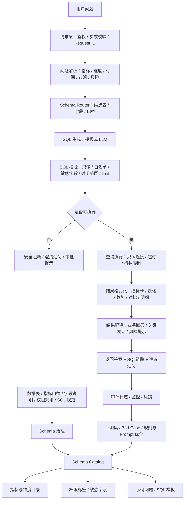
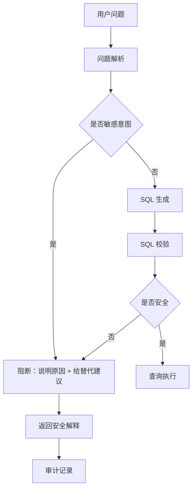

# 生产级 NL2SQL 流程框架图

> 目标：理解真实工作里的 NL2SQL 不是“用户问题 + 大模型 = SQL”这么简单，
> 而是一套包含 Schema 治理、问题解析、SQL 生成、SQL 校验、权限控制、查询执行、
> 结果解释、审计追踪和评测迭代的工程系统。

---

## 笔记定位

这是一篇专题架构长文，不是单日学习笔记。
它用于长期解释生产级 NL2SQL 的元数据治理、在线查询链路、安全风控、结果解释、
服务化交付和评测监控。

后续引用本笔记时，默认结合金融信贷场景理解：
授信申请、额度审批、风控评级、反欺诈、放款、还款、逾期、贷后、催收和合规审计，
都可以作为 NL2SQL 表结构、指标口径、权限边界和查询安全的例子。

---

## 1. 生产级 NL2SQL 总览



一句话：

> 生产级 NL2SQL = 离线把表、字段、指标、权限和规则治理好，
> 在线把用户问题安全地转成 SQL、执行查询、解释结果，并通过审计和评测持续优化。

---

## 2. 两条主链路

生产级 NL2SQL 通常分成两条链路。

- 表格行 1
  - 链路：离线元数据治理链路
  - 作用：把可查询的表、字段、指标、维度、权限和 SQL 规则整理成可用目录
  - 什么时候发生：新表上线、字段变更、指标口径调整、权限规则更新时
- 表格行 2
  - 链路：在线数据问答链路
  - 作用：用户提问后解析问题、生成 SQL、校验安全、执行查询并解释结果
  - 什么时候发生：每次用户请求时

大白话：

> 离线链路负责“告诉系统能查什么、怎么算、谁能查”，
> 在线链路负责“把用户问题变成安全查询并解释结果”。

---

## 3. 离线 Schema 治理链路

```text
┌────────────────────────┐
│ 1. 原始元数据           │
│ 表结构 / 字段 / 指标     │
│ 权限 / SQL规范 / 示例    │
└───────────┬────────────┘
            ▼
┌────────────────────────┐
│ 2. 元数据治理           │
│ 命名规范 / 去重 / 版本   │
│ 业务域 / Owner / 标签    │
└───────────┬────────────┘
            ▼
┌────────────────────────┐
│ 3. 指标口径治理         │
│ 分子分母 / 统计周期      │
│ 粒度 / 过滤条件          │
└───────────┬────────────┘
            ▼
┌────────────────────────┐
│ 4. 权限与敏感字段治理   │
│ 表级 / 字段级 / 行级     │
│ 脱敏 / 审批 / 审计       │
└───────────┬────────────┘
            ▼
┌────────────────────────┐
│ 5. Schema Catalog       │
│ 表 / 字段 / 指标 / 维度  │
│ 时间字段 / 示例问题      │
└───────────┬────────────┘
            ▼
┌────────────────────────┐
│ 6. 模板与评测样例       │
│ SQL模板 / 问题集 / BadCase│
└────────────────────────┘
```

### 3.1 原始元数据

NL2SQL 的基础不是模型，而是元数据。

常见元数据包括：

- 表名
- 表描述
- 字段名
- 字段类型
- 字段含义
- 指标口径
- 维度字段
- 时间字段
- 分区字段
- 表粒度
- 数据 owner
- 权限等级
- 敏感字段标签
- 示例问题
- SQL 使用规范

结合金融信贷场景，常见表包括：

- 授信申请日汇总表
- 放款日汇总表
- 还款逾期日汇总表
- 授信申请明细表
- 客户维表
- 风控规则命中表
- 催收跟进表

大白话：

> 模型不知道公司数据库里有什么表。Schema Catalog 就是给模型和规则系统看的“数据地图”。

### 3.2 元数据治理

元数据治理要先解决“表和字段到底能不能用”。

要检查：

- 表是否仍在维护
- 字段是否过期
- 字段含义是否清楚
- 表粒度是否明确
- 是否有 owner
- 是否有权限标签
- 是否有敏感字段
- 是否和其他表字段重复或冲突
- 是否适合暴露给 NL2SQL

生产里一个常见问题是：同一个业务词在不同表里含义不同。

例如：

```text
approval_amount
approved_amount
credit_amount
```

它们可能都被业务叫“授信额度”，但含义可能分别是申请额度、审批额度和最终授信额度。
如果 Catalog 没治理清楚，NL2SQL 很容易生成语法正确但业务错误的 SQL。

### 3.3 指标口径治理

指标口径是 NL2SQL 的核心。

例如：

```text
授信通过率 = 授信通过量 / 授信申请量
逾期率 = 逾期金额 / 应还金额
平均授信额度 = 授信额度总额 / 授信通过申请数
```

指标治理至少要说明：

- 指标英文名
- 中文业务名
- 分子
- 分母
- 过滤条件
- 统计周期
- 时间字段
- 适用表
- 可用维度
- 是否可直接平均
- 是否需要去重
- 是否有权限限制

生产里比例指标尤其容易出错。

坏写法：

```sql
avg(approval_rate)
```

好写法：

```sql
sum(approval_count) / nullif(sum(application_count), 0)
```

大白话：

> 指标不是字段名这么简单。NL2SQL 必须知道指标怎么算，否则 SQL 看起来对，结果可能错。

### 3.4 权限与敏感字段治理

金融信贷数据里，权限治理非常关键。

敏感字段包括：

- 手机号
- 身份证号
- 银行卡号
- 客户姓名
- 详细地址
- 客户 ID
- 授信明细
- 风控命中明细
- 催收记录

权限可以分层：

- 表格行 1
  - 权限层级：公开
  - 例子：脱敏后的指标口径说明
  - 处理方式：可被普通数据问答使用
- 表格行 2
  - 权限层级：内部
  - 例子：授信申请日汇总表、放款汇总表
  - 处理方式：需要登录和业务域权限
- 表格行 3
  - 权限层级：受限
  - 例子：授信申请明细表、客户申请记录
  - 处理方式：需要精确过滤、limit 和审计
- 表格行 4
  - 权限层级：敏感
  - 例子：手机号、身份证号、银行卡号
  - 处理方式：默认阻断或走审批

大白话：

> NL2SQL 不是用户想查什么就查什么。越接近客户明细，权限和审计要求越高。

### 3.5 Schema Catalog

Schema Catalog 是 NL2SQL 的核心输入。

一个可用 Catalog 通常包含：

```json
{
  "table_name": "dws_credit_application_daily",
  "description": "授信申请按天汇总表",
  "grain": "dt + product_type + channel + risk_level",
  "permission_level": "internal",
  "columns": [
    {
      "name": "approval_count",
      "type": "int",
      "role": "metric",
      "description": "授信通过量"
    }
  ],
  "metrics": ["application_count", "approval_count", "approval_rate"],
  "dimensions": ["product_type", "channel", "risk_level"],
  "time_fields": ["dt"],
  "aliases": ["授信申请", "通过率", "申请渠道"]
}
```

Catalog 的价值：

- 限制模型不要编造表字段
- 帮助选择候选表
- 约束指标和维度
- 提供时间字段和表粒度
- 标记权限和敏感字段
- 支持 SQL 校验和审计

### 3.6 SQL 模板与评测样例

生产 NL2SQL 不一定所有问题都靠 LLM 生成。

高频、结构稳定的问题适合模板：

- 单指标查询
- 分组查询
- 趋势查询
- TopN 查询
- 周期对比
- 精确明细查询

模板的好处：

- 稳定
- 可测试
- 可解释
- 容易加安全限制
- 成本低

LLM 更适合：

- 非标准表达
- 复杂意图识别
- 候选字段 rerank
- SQL 草稿生成
- 结果解释润色

大白话：

> 模板是生产 baseline，LLM 是增强能力。两者都必须受 Catalog 和校验层约束。

---

## 4. 在线 NL2SQL 问答链路

```text
┌────────────────────────┐
│ 1. 用户入口             │
│ Web / API / 数据门户    │
│ 企业 IM / BI 插件       │
└───────────┬────────────┘
            ▼
┌────────────────────────┐
│ 2. 请求层               │
│ 鉴权 / 参数校验 / 限流   │
│ Request ID / 审计日志    │
└───────────┬────────────┘
            ▼
┌────────────────────────┐
│ 3. 问题解析             │
│ 指标 / 维度 / 时间       │
│ 过滤 / TopN / 风险标记   │
└───────────┬────────────┘
            ▼
┌────────────────────────┐
│ 4. Schema 路由          │
│ 候选表 / 字段 / 口径     │
│ 表粒度 / 权限标签        │
└───────────┬────────────┘
            ▼
┌────────────────────────┐
│ 5. SQL 生成             │
│ 模板 / LLM / 约束生成    │
│ 只读 SQL / 参数化        │
└───────────┬────────────┘
            ▼
┌────────────────────────┐
│ 6. SQL 校验             │
│ 只读 / 危险关键字        │
│ 白名单 / 敏感字段        │
│ 时间范围 / limit / 成本  │
└───────────┬────────────┘
            ▼
┌────────────────────────┐
│ 7. 权限与审批           │
│ 用户角色 / 字段权限      │
│ 敏感查询 / 人工审批      │
└───────────┬────────────┘
            ▼
┌────────────────────────┐
│ 8. 查询执行             │
│ 只读连接 / 超时 / 分页   │
│ 最大行数 / 查询网关      │
└───────────┬────────────┘
            ▼
┌────────────────────────┐
│ 9. 结果格式化           │
│ 指标卡 / 表格 / 趋势     │
│ 对比 / 明细 / 空结果     │
└───────────┬────────────┘
            ▼
┌────────────────────────┐
│ 10. 结果解释            │
│ 业务回答 / 关键发现      │
│ 风险提示 / 建议追问      │
└───────────┬────────────┘
            ▼
┌────────────────────────┐
│ 11. 响应与审计          │
│ answer / SQL / trace    │
│ request_id / audit log  │
└───────────┬────────────┘
            ▼
┌────────────────────────┐
│ 12. 评测与反馈          │
│ bad case / 回归集        │
│ 口径修复 / Prompt优化    │
└────────────────────────┘
```

### 4.1 用户入口

NL2SQL 的入口可能是：

- 数据门户
- BI 平台
- 运营后台
- 风控分析平台
- 企业微信 / 飞书 / 钉钉机器人
- 后端 API
- 管理驾驶舱

用户可能是：

- 运营同学
- 风控策略同学
- 产品经理
- 数据分析师
- 管理层
- 客服或催收管理人员

入口不同，但后端链路应该复用同一套 Schema、权限和校验规则。

### 4.2 请求层

请求层负责基础工程控制。

包括：

- 用户身份识别
- 用户角色
- 参数校验
- 限流
- request_id
- 请求日志
- 黑名单或敏感意图检查

大白话：

> 先确认“谁在问、能不能问、请求是否合法”，再进入 NL2SQL。

### 4.3 问题解析层

问题解析层把自然语言拆成结构化信息。

示例：

```text
上周每个渠道的授信通过率是多少？
```

解析结果：

```json
{
  "query_type": "group_by",
  "metrics": ["approval_rate"],
  "dimensions": ["channel"],
  "time_range": "last_week",
  "filters": {},
  "risk_flags": []
}
```

需要抽取：

- query_type
- metrics
- dimensions
- time_range
- filters
- top_n
- sort
- risk_flags

常见问题类型：

- 单指标
- 分组
- 趋势
- TopN
- 对比
- 明细
- 敏感查询
- 无法解析

大白话：

> 问题解析层不是生成 SQL，而是先搞清楚用户到底想查什么。

### 4.4 Schema 路由层

Schema 路由层决定查哪张表、哪些字段。

它要结合：

- 指标字段
- 维度字段
- 时间字段
- 过滤条件
- 表粒度
- 权限等级
- 业务域

例子：

```text
问题：最近 7 天放款金额趋势怎么样？
候选表：dws_loan_disbursement_daily
指标：disbursement_amount
维度：dt
时间字段：dt
```

如果 Schema 路由错了，后面 SQL 生成再漂亮也没用。

### 4.5 SQL 生成层

SQL 生成层把结构化解析结果和 Schema Catalog 转成 SQL。

生成方式可以是：

- 规则模板
- LLM 生成
- 模板 + LLM 补全
- LLM 选择模板
- LLM 生成草稿后规则修正

生产约束：

- 只能生成只读 SQL
- 只能使用白名单表字段
- 必须带时间范围
- 明细查询必须有精确过滤和 limit
- 比例指标必须使用正确分子分母
- 不允许查询敏感字段
- 不允许直接执行

坏例子：

```sql
select avg(approval_rate)
from dws_credit_application_daily;
```

好例子：

```sql
select
  channel,
  sum(approval_count) / nullif(sum(application_count), 0) as approval_rate
from dws_credit_application_daily
where dt between date_trunc('week', current_date) - interval '7' day
  and date_trunc('week', current_date) - interval '1' day
group by channel;
```

### 4.6 SQL 校验层

SQL 校验层是执行前硬闸门。

检查项包括：

- 是否只读
- 是否包含 `insert / update / delete / drop / alter / truncate`
- 是否使用白名单表
- 是否使用白名单字段
- 是否查询敏感字段
- 大表是否带时间范围
- 明细查询是否有精确过滤
- 是否有 limit
- 是否存在 `select *`
- 是否有高成本排序
- 是否存在 join 放大风险

大白话：

> SQL 能生成，不代表能执行。SQL 校验层负责把错误、越权和高成本查询挡在数据库外面。

### 4.7 权限与审批层

SQL 静态校验通过后，还要看当前用户有没有权限。

权限类型：

- 表级权限
- 字段级权限
- 行级权限
- 业务域权限
- 敏感数据审批
- 导出审批

例子：

```text
普通运营：可以查渠道通过率汇总
风控分析：可以查风险等级维度
数据管理员：可以查更多明细
任何普通用户：不能直接导出手机号和身份证号
```

生产里权限系统通常不只靠 prompt，也不只靠 SQL 正则。
它要接公司统一用户体系、角色体系和数据权限平台。

### 4.8 查询执行层

查询执行层负责真正访问数据库。

生产要求：

- 使用只读连接
- 不连生产主库
- 通过查询网关
- 设置超时时间
- 限制返回行数
- 支持分页
- 限制导出
- 记录执行耗时
- 记录扫描量或估算成本
- 保存审计日志

大白话：

> 查询执行层不是简单 `execute(sql)`。它要保护数据库，也要保护数据安全。

### 4.9 结果格式化层

数据库返回的是行列结果。
系统要先格式化成前端和解释层能理解的结构。

常见 response type：

- `scalar`：单指标
- `table`：普通表格
- `trend_table`：趋势序列
- `comparison`：当前值、上期值、差值
- `detail_table`：明细
- `safely_blocked`：安全阻断
- `empty_result`：查询成功但无数据
- `execution_error`：执行失败

大白话：

> 不同问题适合不同展示方式。不要把所有结果都当成普通表格。

### 4.10 结果解释层

结果解释层把结构化结果转成业务语言。

输出通常包括：

- business_answer
- key_findings
- risk_notes
- follow_up_questions
- source_result

例子：

```text
当前周期逾期率为 7.03%，上期为 8.56%，较上期下降 1.53 个百分点。
风险提示：比例指标必须说明分子分母口径，不能只看差值判断风险已经改善。
建议追问：是否需要按产品、风险等级或逾期账龄拆分变化原因？
```

注意：

> 结果解释层只能解释“查出来的事实”，不能编造“为什么发生”。

比如逾期率下降，只能说下降了多少，不能直接说“因为催收策略改善”。
原因分析需要更多维度和证据。

### 4.11 响应与审计层

一个更工程化的 NL2SQL 响应可以长这样：

```json
{
  "request_id": "xxx",
  "question": "本周逾期率比上周变化多少？",
  "final_status": "answered",
  "answer": "当前周期逾期率为 7.03%，上期为 8.56%，较上期下降 1.53 个百分点。",
  "key_findings": ["当前值：7.03%。", "上期值：8.56%。"],
  "risk_notes": ["比例指标必须说明分子分母口径。"],
  "pipeline": {
    "parse": "available",
    "sql_generation": "passed",
    "sql_validation": "passed",
    "query_execution": "executed",
    "result_interpretation": "available"
  },
  "sql": "select ...",
  "row_count": 1
}
```

审计记录要保存：

- request_id
- user_id
- question
- parsed result
- generated SQL
- validation result
- execution status
- row_count
- final answer
- latency
- created_at

审计的价值：

- 排查 bad case
- 追踪越权风险
- 复盘指标口径争议
- 分析成本和性能
- 支持合规检查

### 4.12 评测与反馈层

NL2SQL 必须有固定评测集。

评测维度包括：

- 问题解析准确率
- 表选择准确率
- 字段选择准确率
- SQL 可执行率
- SQL 正确率
- 安全阻断准确率
- 敏感字段漏拦率
- 大表无时间范围漏拦率
- 结果解释忠实度
- 响应延迟
- 查询成本

常见 bad case：

- 时间范围漏解析
- 指标口径错
- 维度和过滤条件混淆
- 选错表
- 编造字段
- 比例指标直接 avg
- 敏感字段未阻断
- 明细查询没有 limit
- 结果解释编造原因

大白话：

> NL2SQL 不是上线后就结束。它必须靠固定测试集、bad case 和审计反馈持续修。

---

## 5. 安全阻断链路

安全阻断不是失败，而是生产 NL2SQL 的核心能力。



应该阻断的例子：

- 导出客户手机号列表
- 查询身份证号
- 删除逾期表数据
- 查询所有申请明细但没有过滤条件
- 大表查询没有时间范围
- 明细查询没有 limit
- 查询未授权业务域
- 使用 `select *`

安全阻断响应应该说明：

- 没有执行数据库查询
- 阻断原因
- 风险类型
- 可以怎么改问
- 是否需要审批

不要这样回答：

```text
没有查到数据。
```

因为被阻断不是没有数据，而是不能查。

---

## 6. 成本与性能控制

NL2SQL 的成本不只来自 LLM，也来自数据库查询。

控制点：

- 问题解析阶段识别缺少时间范围
- SQL 生成阶段强制加时间条件
- SQL 校验阶段阻断大表全量扫描
- 执行阶段设置超时和最大行数
- 结果阶段限制返回体大小
- 审计阶段记录耗时和行数
- 评测阶段分析慢查询和高成本样例

常见规则：

- 汇总表必须有 `dt` 条件
- 明细表必须有 `application_id` 或 `customer_id`
- 明细查询必须有 `limit`
- TopN 必须有 `limit`
- 大结果导出必须走审批
- 默认不返回敏感字段

---

## 7. NL2SQL 与 RAG 的关系

NL2SQL 和 RAG 不是互斥关系。

NL2SQL 负责查结构化数据，RAG 负责查文档知识。

- 表格行 1
  - 能力：RAG
  - 适合问题：指标口径、政策解释、规则说明、FAQ
  - 例子：授信通过率的业务定义是什么？
- 表格行 2
  - 能力：NL2SQL
  - 适合问题：实时或离线数据统计
  - 例子：上周每个渠道的授信通过率是多少？
- 表格行 3
  - 能力：RAG + NL2SQL
  - 适合问题：先查口径，再查数据，再解释结果
  - 例子：按授信通过率口径，分析上周渠道表现。

生产里更完整的数据问答系统会组合两者：

```text
用户问题
-> 判断是文档问题、数据问题还是混合问题
-> 文档问题走 RAG
-> 数据问题走 NL2SQL
-> 混合问题先 RAG 查口径，再 NL2SQL 查数据，最后统一解释
```

---

## 8. 服务化交付结构

生产 NL2SQL 最终通常会服务化。

```text
┌────────────────────────┐
│ API 层                  │
│ /nl2sql/ask /health     │
└───────────┬────────────┘
            ▼
┌────────────────────────┐
│ Service 编排层          │
│ parser -> generator     │
│ validator -> executor   │
└───────────┬────────────┘
            ▼
┌────────────────────────┐
│ Domain 能力层           │
│ Schema / SQL / 权限      │
│ 结果解释 / 审计          │
└───────────┬────────────┘
            ▼
┌────────────────────────┐
│ Infrastructure 层       │
│ DB / 配置 / 日志 / 缓存   │
│ Docker / 监控 / 测试     │
└────────────────────────┘
```

本仓库 Week 6 的服务化项目已经按这个方向拆分：

```text
projects/day36_42_nl2sql_service/
├── app/
│   ├── main.py
│   ├── schemas.py
│   ├── services.py
│   ├── storage.py
│   ├── config.py
│   └── errors.py
├── docs/
│   ├── api_contract.md
│   ├── storage_decision.md
│   └── deployment.md
├── tests/
│   └── test_api.py
├── Dockerfile
├── .env.example
└── README.md
```

---

## 9. 本仓库学习链路映射

当前仓库的 NL2SQL 学习主线已经覆盖完整链路：

- 表格行 1
  - Day：Day 29
  - 模块：Schema 与问题类型
  - 对应生产层：Schema Catalog / Schema Router
  - 产物：`projects/day29_nl2sql_schema_router/`
- 表格行 2
  - Day：Day 30
  - 模块：问题解析
  - 对应生产层：Question Parser
  - 产物：`projects/day30_nl2sql_question_parser/`
- 表格行 3
  - Day：Day 31
  - 模块：SQL 生成
  - 对应生产层：SQL Generator
  - 产物：`projects/day31_nl2sql_sql_generator/`
- 表格行 4
  - Day：Day 32
  - 模块：SQL 校验
  - 对应生产层：SQL Validator / Guardrail
  - 产物：`projects/day32_nl2sql_sql_validator/`
- 表格行 5
  - Day：Day 33
  - 模块：查询执行
  - 对应生产层：Query Executor
  - 产物：`projects/day33_nl2sql_query_executor/`
- 表格行 6
  - Day：Day 34
  - 模块：结果解释
  - 对应生产层：Result Interpreter
  - 产物：`projects/day34_nl2sql_result_interpreter/`
- 表格行 7
  - Day：Day 35
  - 模块：项目整合
  - 对应生产层：End-to-end Pipeline
  - 产物：`projects/day35_nl2sql_assistant/`
- 表格行 8
  - Day：Day 36-42
  - 模块：服务化交付
  - 对应生产层：API / Config / Storage / Test / Deploy
  - 产物：`projects/day36_42_nl2sql_service/`

---

## 10. 面试表达版本

如果面试官问：

```text
你这个 NL2SQL 项目怎么设计？
```

可以这样答：

> 我不会把 NL2SQL 理解成单纯让模型生成 SQL。
> 我的设计是先治理 Schema Catalog，把表、字段、指标口径、时间字段、权限标签和敏感字段整理清楚；
> 用户提问后，先做问题解析，抽取指标、维度、时间范围、过滤条件和风险标记；
> 然后用 Schema Router 选择候选表，用模板或 LLM 生成只读 SQL；
> 生成后不直接执行，而是经过 SQL Validator 检查只读、危险关键字、表字段白名单、敏感字段、
> 时间范围、limit 和成本风险；
> 校验通过后才使用只读连接执行，并限制超时和返回行数；
> 最后把结果格式化并解释成业务语言，同时保留 request_id、SQL、校验结果和执行状态用于审计。
> 对于手机号导出、无时间范围大表查询、危险 SQL 这类问题，系统会安全阻断并给出替代建议。

再补一句项目亮点：

> 这个设计的重点不是“能生成 SQL”，而是能在金融信贷场景里安全、可控、可追溯地查数。

---

## 11. 最重要的几句话

- NL2SQL 不是自然语言直接生成 SQL，而是 Schema、权限、校验、执行和解释的完整系统。
- Schema Catalog 是 NL2SQL 的地基，没有它模型会编造表字段和口径。
- SQL 生成后不能直接执行，必须经过只读、白名单、敏感字段、时间范围和成本校验。
- 安全阻断不是失败，而是生产系统必须具备的能力。
- 结果解释层只能解释查询事实，不能编造业务原因。
- 审计记录和中间结果是排查 bad case、合规追踪和持续优化的基础。
- RAG 查文档口径，NL2SQL 查结构化数据，两者组合才是更完整的数据问答系统。
