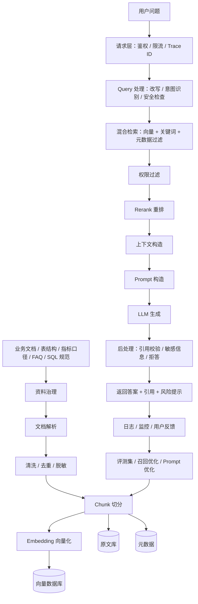

# 生产级 RAG 流程框架图

> 目标：理解真实工作里的 RAG 不是“文档切分 + 向量检索 + 调模型”这么简单，
> 而是一套包含资料治理、索引构建、在线检索、权限控制、回答生成、评测监控和反馈迭代的工程系统。

---

## 笔记定位

这是一篇专题架构长文，不是单日学习笔记。 它用于长期解释生产级 RAG 的离线入库、在线问答、权限安全、评测监控和工程分层。

后续引用本笔记时，默认结合金融信贷场景理解： 授信政策、风控规则、贷后 FAQ、指标口径、表结构说明和合规审计资料， 都可以作为 RAG
知识库治理和权限过滤的例子。

---

## 1. 生产级 RAG 总览



一句话：

> 生产级 RAG = 离线把资料治理好并建索引，在线根据用户问题检索资料，
> 再让模型基于资料回答，最后用评测、监控和反馈持续优化。

---

## 2. 两条主链路

生产级 RAG 通常分成两条链路。

- 表格行 1
  - 链路：离线入库链路
  - 作用：把原始文档处理成可检索的知识库
  - 什么时候发生：文档新增、更新、定时同步时
- 表格行 2
  - 链路：在线问答链路
  - 作用：用户提问后检索资料并生成回答
  - 什么时候发生：每次用户请求时

大白话：

> 离线链路负责“把资料整理好”，在线链路负责“用资料回答问题”。

---

## 3. 离线知识入库链路

```text
┌────────────────────────┐
│ 1. 原始文档             │
│ PDF / Markdown / DB文档 │
└───────────┬────────────┘
            ▼
┌────────────────────────┐
│ 2. 文档治理             │
│ 去重 / 清洗 / 脱敏       │
│ 版本管理 / 权限标记      │
└───────────┬────────────┘
            ▼
┌────────────────────────┐
│ 3. 文档解析             │
│ 标题 / 段落 / 表格       │
│ 图片 OCR / 代码块        │
└───────────┬────────────┘
            ▼
┌────────────────────────┐
│ 4. Chunk 切分           │
│ 按标题 / 段落 / 语义     │
│ 保留上下文 overlap       │
└───────────┬────────────┘
            ▼
┌────────────────────────┐
│ 5. Embedding            │
│ 文本转向量              │
└───────────┬────────────┘
            ▼
┌────────────────────────┐
│ 6. 索引入库             │
│ 向量库 + 原文 + 元数据   │
│ 文档ID / 权限 / 来源     │
└────────────────────────┘
```

### 3.1 原始文档

真实 RAG 项目的资料通常不是一种格式，而是来自很多地方。

常见资料包括：

- 指标口径文档
- 数据表结构说明
- SQL 开发规范
- 业务 FAQ
- 产品文档
- 接口文档
- 历史工单
- 项目 README
- 数据质量规则
- 权限和数据安全规范

结合你当前的学习方向，第一批最适合入库的资料是：

- SQL 解释助手 README
- SQL 风险规则说明
- 指标口径说明
- 表结构说明
- 数仓开发规范
- 面试讲解提纲
- 术语表

### 3.2 文档治理

文档治理就是先判断哪些资料能进入知识库。

要检查：

- 文档是否过期
- 是否有重复版本
- 是否和其他文档互相冲突
- 是否包含敏感信息
- 是否有明确来源
- 是否有权限等级
- 是否真的能回答具体问题

大白话：

> RAG 不是把所有文件一股脑塞进去。脏资料进去，脏答案出来。

生产里的一个常见问题是：知识库里同时存在新旧两个指标口径。

如果模型检索到旧口径，就会给出看似合理但业务错误的答案。所以入库前要做版本和有效期管理。

### 3.3 文档解析

文档解析是把不同格式的资料变成统一文本结构。

常见输入格式：

- Markdown
- PDF
- Word
- HTML
- CSV / Excel
- 数据库表结构
- Wiki 页面
- 图片 OCR 结果

生产里需要注意：

- PDF 里的表格容易解析乱
- Word 的标题层级可能不稳定
- Excel 表头可能跨行
- 图片和扫描件需要 OCR
- 代码块和 SQL 示例不能被误删

大白话：

> 文档解析就是先把各种格式的资料“拆开读懂”，再交给后面的切分和检索。

### 3.4 清洗、去重、脱敏

清洗常见动作：

- 去掉页眉页脚
- 去掉无意义空行
- 统一标题格式
- 删除乱码
- 保留关键表格和代码块

去重常见动作：

- 删除重复文档
- 合并重复段落
- 保留最新版本
- 标记历史版本为不可检索

脱敏常见动作：

- 去掉手机号
- 去掉身份证
- 去掉客户名称
- 去掉真实密钥
- 去掉内部敏感链接
- 替换真实业务 ID

生产里不能忽略脱敏。

即使模型回答正确，如果把无权限信息或敏感数据泄露给用户，也是严重事故。

### 3.5 Chunk 切分

Chunk 就是文档切片。

切分策略要看文档类型。

- 表格行 1
  - 文档类型：指标口径
  - 推荐切法：按指标切
  - 原因：一个 chunk 包含一个完整指标定义
- 表格行 2
  - 文档类型：表结构
  - 推荐切法：按表切
  - 原因：一个 chunk 包含一张表的字段说明
- 表格行 3
  - 文档类型：FAQ
  - 推荐切法：按问答对切
  - 原因：问题和答案天然成对
- 表格行 4
  - 文档类型：SQL 规范
  - 推荐切法：按规则条目切
  - 原因：每条规则可以独立召回
- 表格行 5
  - 文档类型：README
  - 推荐切法：按标题切
  - 原因：保留项目功能和运行说明结构

坏切分：

```text
每 500 个字硬切一次。
```

好切分：

```text
一个 chunk 尽量包含一个完整概念，比如一个指标、一个表、一个规则。
```

生产里还会用 overlap。

大白话：

> overlap 是相邻 chunk 之间保留一点重复内容，避免切分时把上下文切断。

例如一条指标定义跨了两个段落，如果完全硬切，检索时可能只召回半段，导致模型理解不完整。

### 3.6 Embedding 向量化

Embedding 是把文本变成向量。

用途：

```text
用户问题向量
和
文档 chunk 向量
做相似度匹配
```

生产里要注意：

- 文档和问题要使用同一套 embedding 模型
- embedding 模型升级后，历史索引可能需要重建
- 中英文混合场景要确认模型效果
- 表结构、代码、SQL 这类文本可能需要专门评测

大白话：

> embedding 不是让模型“真的懂业务”，而是让系统能计算“这段话和问题像不像”。

### 3.7 索引入库

生产级 RAG 通常不只存向量。

要存三类东西：

- 表格行 1
  - 存储：向量库
  - 存什么：chunk 的 embedding
  - 用途：相似度检索
- 表格行 2
  - 存储：原文库
  - 存什么：chunk 原文
  - 用途：组装上下文、展示引用
- 表格行 3
  - 存储：元数据
  - 存什么：文档名、权限、版本、更新时间
  - 用途：过滤、审计、追踪

元数据非常关键。

常见元数据包括：

- `doc_id`
- `chunk_id`
- `source`
- `title`
- `version`
- `owner`
- `updated_at`
- `permission_level`
- `business_domain`
- `tags`

没有元数据，后续就很难做权限过滤、版本追踪和引用展示。

---

## 4. 在线问答链路

```text
┌────────────────────────┐
│ 1. 用户入口             │
│ Web / API / 企业 IM     │
└───────────┬────────────┘
            ▼
┌────────────────────────┐
│ 2. 请求层               │
│ 鉴权 / 参数校验 / 限流   │
│ Trace ID / 请求日志      │
└───────────┬────────────┘
            ▼
┌────────────────────────┐
│ 3. Query 处理层         │
│ 清洗 / 改写 / 意图识别   │
│ 安全检查 / 上下文压缩    │
└───────────┬────────────┘
            ▼
┌────────────────────────┐
│ 4. 检索层               │
│ 向量检索 + BM25         │
│ 元数据过滤 + 权限过滤    │
└───────────┬────────────┘
            ▼
┌────────────────────────┐
│ 5. Rerank 重排          │
│ 排序 / 去重 / 过滤弱相关 │
└───────────┬────────────┘
            ▼
┌────────────────────────┐
│ 6. 上下文构造           │
│ 问题 + 文档 + 引用来源   │
│ 控制 token 长度          │
└───────────┬────────────┘
            ▼
┌────────────────────────┐
│ 7. LLM 生成             │
│ 低 temperature / 重试    │
│ 降级 / 结构化输出        │
└───────────┬────────────┘
            ▼
┌────────────────────────┐
│ 8. 后处理               │
│ 引用校验 / 敏感过滤      │
│ 幻觉检测 / 拒答          │
└───────────┬────────────┘
            ▼
┌────────────────────────┐
│ 9. 响应层               │
│ 答案 / 引用 / 风险提示   │
│ 继续追问                │
└───────────┬────────────┘
            ▼
┌────────────────────────┐
│ 10. 观测与评测          │
│ 日志 / 反馈 / 成本延迟   │
│ 失败样本 / 质量评测      │
└────────────────────────┘
```

### 4.1 用户入口

用户入口可能是：

- Web 页面
- 后端 API
- 企业微信 / 飞书 / 钉钉机器人
- 数据平台里的问答入口
- BI 报表里的智能助手

入口不同，但后端 RAG 链路可以复用。

### 4.2 请求层

请求层先处理基础工程问题。

包括：

- 用户身份识别
- 权限校验
- 参数校验
- 限流 / 防刷
- Trace ID
- 请求日志

大白话：

> 先确认“谁在问、能不能问、请求是否合法”，再进入 RAG。

实际生产里，Trace ID 很重要。

当用户反馈“这个问题答错了”，你需要通过 Trace ID 找到当时的问题、召回片段、模型输入、模型输出和耗时。

### 4.3 Query 处理层

用户问题经常不适合直接检索。

例如：

```text
这个怎么算？
```

系统要结合上下文改写成：

```text
active_users 指标的统计口径是什么？
```

Query 处理层常做：

- 问题清洗
- 意图识别
- Query Rewrite
- 多轮上下文压缩
- 敏感词检查
- 越权问题拦截

大白话：

> Query 处理层就是把用户随口问的问题，改造成更适合检索的问题。

### 4.4 检索层

生产里不要只靠向量检索。

常见组合是：

```text
向量检索 + 关键词检索 BM25 + 元数据过滤 + 权限过滤
```

为什么要混合检索？

- 向量检索适合语义相近的问题
- BM25 适合精确关键词、表名、字段名、错误码
- 元数据过滤适合按业务域、版本、文档类型筛选
- 权限过滤保证用户只能看到允许范围内的资料

例子：

用户问：

```text
dwd_user_event_di 这张表有哪些字段？
```

这种问题里表名非常关键。只靠向量检索可能不如关键词检索稳定。

### 4.5 权限过滤

权限过滤是生产 RAG 的关键。

用户不能看到没有权限的资料。

例子：

```text
用户 A 只能看公共指标文档
用户 B 可以看交易主题域表结构
用户 C 可以看财务指标口径
```

所以检索时不能只看相似度，还要看权限。

权限过滤最好在检索前后都做：

- 检索前：用 metadata filter 限定可见文档范围
- 检索后：再次检查召回 chunk 是否越权

### 4.6 Rerank 重排层

第一次召回的结果不一定最准确。

Rerank 会重新排序，把最相关的文档片段放前面，把弱相关的过滤掉。

生产里常见做法：

- 先召回较多候选，例如 top 20
- 再重排取前 5
- 去掉重复 chunk
- 过滤低相关片段
- 控制最终上下文长度

大白话：

> 检索层负责“先捞一批可能相关的”，重排层负责“再挑最靠谱的”。

### 4.7 上下文构造层

上下文构造层把检索到的资料整理成模型能读的输入。

通常包括：

- 用户问题
- 改写后的检索问题
- top-k 文档片段
- 每个片段的来源
- 回答规则
- 不足以回答时的拒答要求

这里要控制 token。

不能无限塞文档，否则成本高、延迟高，还可能把无关内容带入模型。

### 4.8 Prompt 构造层

Prompt 构造层决定模型怎么回答。

生产 RAG 的 prompt 通常会强调：

```text
只能基于给定上下文回答
如果上下文不足，必须说明无法确认
必须返回引用来源
不要编造表结构、字段或指标口径
输出格式要稳定
```

对于数据问答和 NL2SQL 场景，这些约束非常重要。

### 4.9 LLM 生成层

LLM 生成层负责调用模型。

生产里要考虑：

- 超时
- 重试
- 降级
- 成本
- 稳定性
- 结构化输出
- 低 temperature

例如：

```text
主模型超时 -> 切换备用模型
JSON 输出失败 -> 带错误原因重试
简单问题 -> 使用便宜模型
复杂问题 -> 使用强模型
```

### 4.10 后处理层

不能模型说什么就直接返回。

要检查：

- 有没有引用依据
- 引用是否真的支持答案
- 有没有敏感信息
- 有没有胡编
- JSON 格式对不对
- 是否应该拒答
- 是否触发人工复核

大白话：

> 后处理层是最后一道闸门，避免模型把不可靠或不合规的内容直接返回给用户。

### 4.11 响应层

返回的不只是答案，最好还包括：

- 引用来源
- 置信度
- 风险提示
- 是否支持追问
- 无法回答的原因
- 建议补充的上下文

一个更工程化的响应可以长这样：

```json
{
  "answer": "SQL 解释助手能识别 select *、缺少 where、缺少 dt 分区等风险。",
  "citations": [
    {
      "source": "sql_risk_rules",
      "chunk_id": "chunk_12"
    }
  ],
  "confidence": "medium",
  "need_human_review": false
}
```

### 4.12 观测与评测层

生产系统必须知道：

- 哪些问题答错了
- 哪些文档没召回
- 哪些答案没有引用
- 用户是否满意
- 成本是多少
- 延迟是多少
- 哪些 prompt 版本效果更好

常见指标：

- 表格行 1
  - 指标：检索命中率
  - 含义：正确资料是否被召回
- 表格行 2
  - 指标：引用命中率
  - 含义：答案是否有依据
- 表格行 3
  - 指标：拒答准确率
  - 含义：不该答时是否拒答
- 表格行 4
  - 指标：用户反馈满意度
  - 含义：用户是否认可答案
- 表格行 5
  - 指标：平均延迟
  - 含义：一次问答耗时
- 表格行 6
  - 指标：单次成本
  - 含义：一次问答消耗多少钱

大白话：

> 没有评测和监控，RAG 系统就不知道自己哪里错，也没法持续优化。

---

## 5. 结合 SQL 解释助手的生产级落地

当前学习项目是 SQL 解释助手 CLI。

它可以逐步升级成生产级 RAG / NL2SQL 辅助系统。

### 5.1 知识库内容

第一批知识库可以包括：

- SQL 解释助手 README
- SQL 风险规则说明
- 数仓 SQL 开发规范
- 表结构说明
- 指标口径说明
- 常见 SQL 优化案例
- 项目讲解提纲

### 5.2 用户问题示例

```text
SQL 解释助手能识别哪些风险？
为什么 select * 有风险？
active_users 是怎么算的？
这段 SQL 为什么不建议上线？
dwd_user_event_di 这张表有哪些字段？
```

### 5.3 生产级回答要求

回答不能只给自然语言。

最好包含：

```json
{
  "answer": "回答内容",
  "risk_level": "low / medium / high",
  "citations": ["引用来源"],
  "missing_context": ["缺少的上下文"],
  "suggestions": ["建议动作"]
}
```

这样后续可以接审批、复核、日志和监控。

### 5.4 关键风险

- 表格行 1
  - 风险：幻觉
  - 例子：编造不存在的字段
  - 控制方式：必须基于引用回答
- 表格行 2
  - 风险：越权
  - 例子：普通用户看到财务指标
  - 控制方式：权限过滤
- 表格行 3
  - 风险：口径错误
  - 例子：使用旧版指标定义
  - 控制方式：文档版本管理
- 表格行 4
  - 风险：召回失败
  - 例子：没找到正确表结构
  - 控制方式：优化 chunk 和检索
- 表格行 5
  - 风险：成本过高
  - 例子：上下文塞太多
  - 控制方式：控制 top-k 和 token
- 表格行 6
  - 风险：延迟过高
  - 例子：检索和模型都慢
  - 控制方式：缓存、降级、异步

---

## 6. 学习版 RAG 和生产级 RAG 的区别

- 表格行 1
  - 对比项：文档来源
  - 学习版 RAG：少量 Markdown
  - 生产级 RAG：多来源、多格式、多版本
- 表格行 2
  - 对比项：文档治理
  - 学习版 RAG：简单整理
  - 生产级 RAG：去重、脱敏、权限、版本
- 表格行 3
  - 对比项：检索
  - 学习版 RAG：向量 top-k
  - 生产级 RAG：混合检索 + 权限过滤 + 重排
- 表格行 4
  - 对比项：生成
  - 学习版 RAG：直接调用模型
  - 生产级 RAG：Prompt 模板、重试、降级
- 表格行 5
  - 对比项：回答
  - 学习版 RAG：返回文本
  - 生产级 RAG：答案 + 引用 + 置信度 + 风险
- 表格行 6
  - 对比项：安全
  - 学习版 RAG：基本不考虑
  - 生产级 RAG：敏感信息、越权、审计
- 表格行 7
  - 对比项：评测
  - 学习版 RAG：手工观察
  - 生产级 RAG：测试集、指标、用户反馈
- 表格行 8
  - 对比项：运维
  - 学习版 RAG：本地脚本
  - 生产级 RAG：日志、监控、成本、延迟

## 一句话总结

> 学习版 RAG 是“检索 + 生成”，生产级 RAG 是“文档治理 + 权限安全 + 混合检索 + 重排 + 上下文控制 + 生成校验 +
> 监控评测”的完整工程系统。
