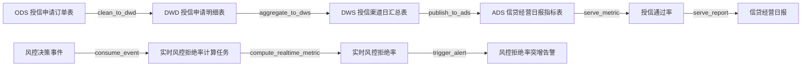

```mermaid
flowchart LR
  ods_credit_apply_order_di["ODS 授信申请订单表"] -->|clean_to_dwd| dwd_credit_apply_detail_di["DWD 授信申请明细表"]
  dwd_credit_apply_detail_di["DWD 授信申请明细表"] -->|aggregate_to_dws| dws_credit_apply_channel_1d["DWS 授信渠道日汇总表"]
  dws_credit_apply_channel_1d["DWS 授信渠道日汇总表"] -->|publish_to_ads| ads_credit_daily_metrics["ADS 信贷经营日报指标表"]
  ads_credit_daily_metrics["ADS 信贷经营日报指标表"] -->|serve_metric| metric_credit_approval_rate["授信通过率"]
  metric_credit_approval_rate["授信通过率"] -->|serve_report| report_credit_operation_daily["信贷经营日报"]
  event_risk_decision_made["风控决策事件"] -->|consume_event| job_rt_risk_reject_rate_10m["实时风控拒绝率计算任务"]
  job_rt_risk_reject_rate_10m["实时风控拒绝率计算任务"] -->|compute_realtime_metric| rt_risk_reject_rate_10m["实时风控拒绝率"]
  rt_risk_reject_rate_10m["实时风控拒绝率"] -->|trigger_alert| alert_risk_reject_rate_spike["风控拒绝率突增告警"]
```